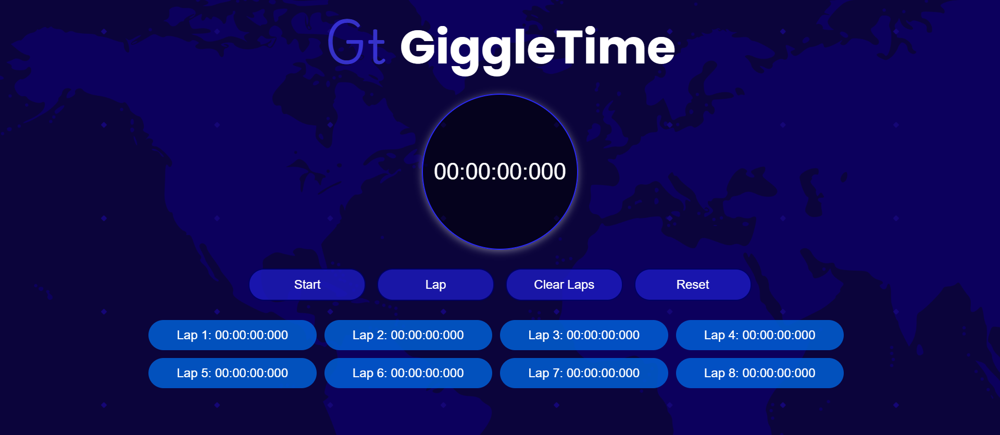

# Stopwatch Web App

## Description

This HTML file represents a simple Stopwatch web application. It features basic functionalities to track time, including start, stop, lap, reset, and clear laps. The UI is styled using external CSS and incorporates custom fonts from Google Fonts.

## Features

- Stopwatch functionality with millisecond precision.
- Start, pause/resume, lap, reset, and clear laps buttons.
- Custom styling with CSS (`styles.css`).
- Custom fonts: Poppins (700 weight) and Playwrite US Modern (100-400 weights) from Google Fonts.
- Responsive design for various screen sizes.

## File Structure

stopwatch/
│
├── index.html # Main HTML file for the Stopwatch app
├── styles.css # CSS file for styling the Stopwatch UI
├── script.js # JavaScript file for implementing Stopwatch functionality
├── icon.png # Icon for the web page
│
└── README.md # Detailed README file for the Stopwatch app

## Usage

1. **Start Stopwatch**: Click the "Start" button to begin the timer.
2. **Pause/Resume**: Click the "Start" button again to pause or resume the timer.
3. **Lap**: Click the "Lap" button to record a lap time while the stopwatch is running.
4. **Clear Laps**: Click the "Clear Laps" button to clear all recorded lap times.
5. **Reset**: Click the "Reset" button to stop the timer and reset it to 00:00:00:000.

## Technologies Used

- HTML5
- CSS3
- JavaScript

## External Libraries

- [Google Fonts](https://fonts.google.com/) - Poppins and Playwrite US Modern fonts.

## Sample UI

